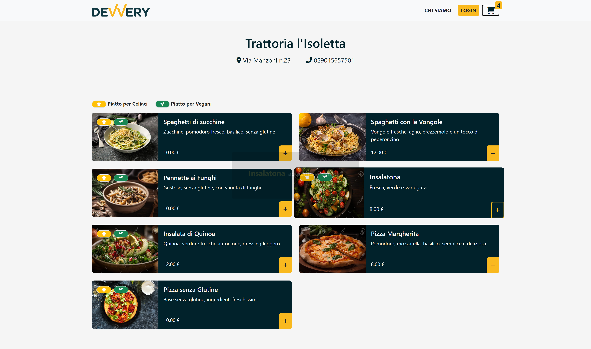
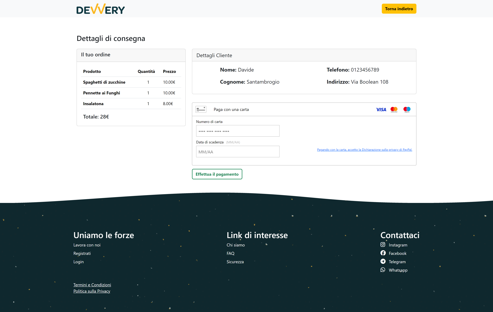

Progetto svolto in collaborazione ad altre quattro studenti durante il mio percorso in boolean.

Devvery è una web app che facilita la consegna di cibo a domicilio di una città. Gli utenti possono cercare i loro piatti preferiti, ordinare dai ristoranti locali e ricevere i pasti comodamente a casa propria.

Implementazioni Frontend e Tecnologie Utilizzate:

- **Vue.js con Vite**: Abbiamo adottato Vue.js come framework JavaScript per lo sviluppo dell'interfaccia utente di Devvery. Vue.js ci consente di creare componenti modulari e reattivi, semplificando la gestione dello stato dell'applicazione e migliorando l'esperienza utente complessiva. Abbiamo integrato Vue con Vite per un'esperienza di sviluppo veloce e snella.

- **Validazione lato Client**: Implementiamo la validazione lato client per garantire che tutti gli input inseriti dagli utenti siano corretti e nel formato appropriato. Utilizziamo le funzionalità di validazione fornite da Vue.js per eseguire controlli di validità sui campi come email, password e indirizzo.

- **Interfaccia Responsiva**: Assicuriamo che l'interfaccia sia completamente responsiva utilizzando CSS3 e Media Queries. Ci assicuriamo che il layout e gli elementi si adattino in modo ottimale a diverse dimensioni e dispositivi, garantendo un'esperienza utente coerente su desktop e dispositivi mobili.

- **Integrazione con Braintree per il Sistema di Pagamento**: Per gestire le transazioni di pagamento online, integreremo Braintree. Utilizziamo le API messe a disposizione da Braintree per consentire agli utenti di effettuare pagamenti in modo sicuro e affidabile direttamente dall'applicazione.

- **Comunicazione con il Backend tramite API**: Comunichiamo con il backend utilizzando chiamate API RESTful per recuperare e inviare dati tra il frontend e il server. Utilizziamo librerie come Axios per gestire le richieste HTTP in modo efficiente e affidabile.

- **Rendering dinamico del contenuto**: Utilizziamo Vue.js per il rendering dinamico del contenuto, consentendo agli utenti di visualizzare in tempo reale i risultati delle loro azioni senza la necessità di ricaricare la pagina. Ad esempio, gli utenti possono aggiungere piatti al carrello e visualizzare il riepilogo dell'ordine senza interruzioni.
 
### Video

[video frontend.webm](https://github.com/DavideSantambrogio/Devvery-front-office/assets/144235842/8621fa60-7a1a-43e5-bf2d-9fa280d89f8c)

<!-- ### Pagina iniziale

### Ricerca per filtri

### Pagina ristorante

### Aggiunta prodotto al carrello

### Carrello

### Checkout e pagamento

### Ordine avvenuto con successo

 -->
